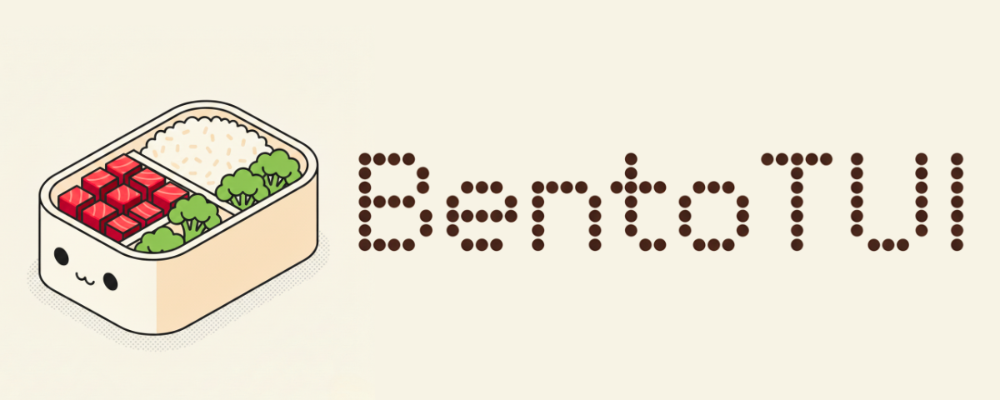

# BentoTUI

> [!WARNING]
> In early production.

[](https://go.dev/)
[](https://github.com/charmbracelet/bubbletea)
[](#status)
[](./CHANGELOG.md)

BentoTUI is an application framework on top of Bubble Tea for building production-grade terminal apps with a structured shell, deterministic layering, and reusable UI primitives.

Charm gives you bricks. BentoTUI gives you rooms.

## Status

BentoTUI is in active `v0.1` development and evolving quickly.

Current focus:

- shell architecture and rendering correctness
- UI layer structure (`ui/components/*`, `ui/styles`)
- footer-first shell contract
- theme system and dialog-driven theme switching

## Feature Snapshot

- shell model with explicit layer order (`body -> footer -> scrim -> dialog`)
- lazy page router and page factories
- fixed/flex split layout system
- focus ring and keyboard routing
- modal dialog manager (`confirm`, `custom`, theme picker)
- semantic theme presets (`catppuccin-mocha`, `dracula`, `osaka-jade`)
- structured UI layer:
  - `ui/components/dialog`
  - `ui/components/footer`
  - `ui/components/panel`
  - `ui/styles`

## Install

```bash
go get github.com/cloudboy-jh/bentotui
```

## Quick Start

```go
package main

import (
	"fmt"

	tea "charm.land/bubbletea/v2"
	"github.com/cloudboy-jh/bentotui"
	"github.com/cloudboy-jh/bentotui/core"
	"github.com/cloudboy-jh/bentotui/core/layout"
	"github.com/cloudboy-jh/bentotui/core/theme"
	"github.com/cloudboy-jh/bentotui/ui/components/panel"
)

func main() {
	m := bentotui.New(
		bentotui.WithTheme(theme.Preset("catppuccin-mocha")),
		bentotui.WithPages(
			bentotui.Page("home", func() core.Page { return newHomePage() }),
		),
		bentotui.WithFooterBar(true),
	)

	p := tea.NewProgram(m)
	if _, err := p.Run(); err != nil {
		fmt.Printf("run failed: %v\n", err)
	}
}

type homePage struct {
	root         *layout.Split
	width, height int
}

func newHomePage() *homePage {
	sidebar := panel.New(panel.Title("Sidebar"), panel.Content(staticText("Sessions\nFiles")))
	main := panel.New(panel.Title("Main"), panel.Content(staticText("Welcome to BentoTUI")))
	root := layout.Horizontal(layout.Fixed(30, sidebar), layout.Flex(1, main))
	return &homePage{root: root}
}

func (p *homePage) Init() tea.Cmd { return nil }
func (p *homePage) Update(msg tea.Msg) (tea.Model, tea.Cmd) {
	_, cmd := p.root.Update(msg)
	return p, cmd
}
func (p *homePage) View() tea.View { return p.root.View() }
func (p *homePage) SetSize(w, h int) {
	p.width, p.height = w, h
	p.root.SetSize(w, h)
}
func (p *homePage) GetSize() (int, int) { return p.width, p.height }
func (p *homePage) Title() string       { return "Home" }

type staticText string

func (s staticText) Init() tea.Cmd                           { return nil }
func (s staticText) Update(msg tea.Msg) (tea.Model, tea.Cmd) { return s, nil }
func (s staticText) View() tea.View                          { return tea.NewView(string(s)) }
```

Fullscreen is enabled by default. Disable it with `bentotui.WithFullScreen(false)`.

## Internal Harness

Run the framework harness:

```bash
go run ./cmd/test-tui
```

Harness validates:

- shell layering and full-frame paint
- footer card behavior and command hints
- modal overlays and focus handling
- theme switching and live repaint

## Docs

- main spec: `project-docs/bentotui-main-spec.md`
- layer architecture: `project-docs/layer-architecture.md`
- framework roadmap: `project-docs/framework-roadmap.md`
- rendering ADR: `project-docs/rendering-system-design.md`
- roadmap: `project-docs/next-steps.md`
- research notes: `project-docs/tui-framework-research.md`
- changelog: `CHANGELOG.md`

## Changelog Policy

This project keeps a human-readable changelog in `CHANGELOG.md` using Keep a Changelog style sections.

## Development

```bash
go test ./...
go vet ./...
```
