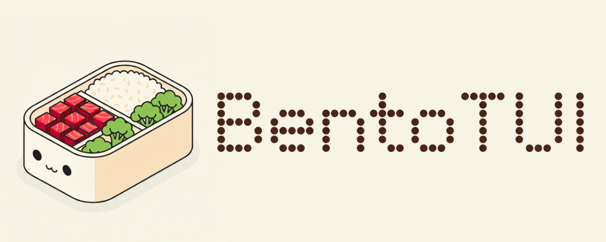
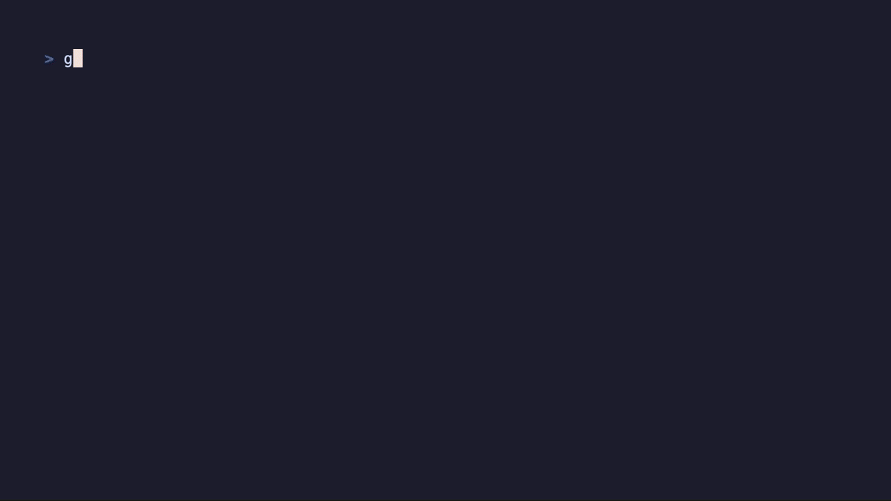

# BentoTUI

> [!WARNING]
> Early development — APIs and registry paths will change.

[](https://go.dev/)
[](https://github.com/charmbracelet/bubbletea)
[](#status)
[](./CHANGELOG.md)

A registry of copy-and-own terminal UI components built on
[Bubble Tea v2](https://github.com/charmbracelet/bubbletea) and
[Lip Gloss v2](https://github.com/charmbracelet/lipgloss).

Official architecture: **Untouchable Theme Engine + Registry**.
You should not hand-color components by default. Pick a theme, compose with
`rooms`, and ship with `bricks`.

Run `bento add input` and the source lands in your project. You own it — read it,
modify it, delete what you don't need. No framework lock-in, no lifecycle hooks,
no "extend" API to learn.

Room composition is handled by `registry/rooms`. Home/starter screens use
`Focus(...)` (body + anchored footer), while multi-row app shells can use
`Frame(...)` (top row, subheader row, body, subfooter). Split layouts now also
support explicit separation with `WithGutter(...)` + `WithDivider(...)`.
Final frame painting and overlays are handled by `surface`.

Bar rows support role-aware rendering (`top`, `subheader`, `footer`) with
anchored footer card styles (`plain`, `chip`, `mixed`) for command focus.

## Docs

- `docs/architecture/architecture.md`
- `docs/architecture/bentos.md`
- `docs/architecture/bricks.md`
- `docs/architecture/rooms.md`
- `docs/theme-engine.md`

## How it works

Three building blocks ship in this repo:

| Thing | What it is |
|-------|-----------|
| **bricks** | UI pieces copied into your project via `bento add`. |
| **bentos** | Full runnable apps (state machine + orchestration). |
| **rooms** | Importable layout grammar under `registry/rooms` (not copied). |

```
registry/bricks/       ← copied into your project by `bento add`
registry/bentos/       ← complete runnable screen patterns
registry/rooms/        ← imported room primitives (not copied)
```

## Install

```bash
# Core deps — these you import, not copy
go get github.com/cloudboy-jh/bentotui

# CLI to copy components into your project
go install github.com/cloudboy-jh/bentotui/cmd/bento@latest
```

## Quick Start

```bash
# See the home screen
go run ./cmd/starter-app

# Run bento examples
go run ./registry/bentos/home-screen
go run ./registry/bentos/app-shell
go run ./registry/bentos/dashboard

# Copy components into your project
bento add input bar surface
```

Home-screen demo:



## Components

All bricks live in `registry/bricks/` and are copied into your project by `bento add`.
Once copied they live at `yourmodule/bricks/<name>` — you own the source.

### Available now

| Component | Description |
|-----------|-------------|
| `surface` | Full-screen cell buffer backed by Ultraviolet. Deterministic background paint — no ANSI whitespace bleed. Used by every full-screen room. |
| `bar` | Role-aware status/nav row with `StatusPill`, compact cards, anchored footer modes (`plain/chip/mixed`), and priority-aware overflow. |
| `input` | Single-line text input with left-border accent. Wraps `bubbles/textinput`. |
| `panel` | Titled, focusable content container. |
| `dialog` | Modal manager — `Confirm`, `Custom`, `ThemePicker`. |
| `list` | Scrollable list with sections, row formatting hooks, and structured row fields (`Primary/Secondary/RightStat/Tone`). |
| `table` | Header + data rows with compact/borderless and per-column width/align. |
| `text` | Static styled label. |
| `badge` | Inline themed label. |
| `kbd` | Keyboard shortcut command + label pair. |
| `wordmark` | Themed heading/title block. |
| `select` | Single-choice inline picker. |
| `checkbox` | Boolean toggle input. |
| `progress` | Horizontal progress bar. |
| `tabs` | Keyboard-navigable tab row. |
| `toast` | Stacked notification rows. |
| `separator` | Horizontal or vertical divider. |

`bento add` currently supports: `surface`, `panel`, `bar`, `dialog`, `list`, `table`, `text`, `input`, `badge`, `kbd`, `wordmark`, `select`, `checkbox`, `progress`, `tabs`, `toast`, `separator`.

Primitive policy: Bento does not ship a `spinner` registry component. Use
`charm.land/bubbles/v2/spinner` directly.

## Bentos

Bentos are complete runnable screen patterns you copy wholesale. Each bento in
`registry/bentos/` is a self-contained `main.go` demonstrating real component usage.

```
registry/bentos/
  home-screen/
  app-shell/
  dashboard/
```

### Current bentos

| Bento | Components used |
|-------|----------------|
| `home-screen` | `wordmark`, `input`, `kbd`, `badge`, `bar`, `surface` |
| `app-shell` | validation bento (scenarios + diagnostics + anchored footer) |
| `dashboard` | `panel`, `badge`, `table`, `bar`, `surface` |

## Core packages (real imports, not copied)

These are stable module deps your project imports directly:

| Package | Import path | What it is |
|---------|-------------|------------|
| `theme` | `github.com/cloudboy-jh/bentotui/theme` | Untouchable Theme Engine runtime store + presets |
| `theme/styles` | `github.com/cloudboy-jh/bentotui/theme/styles` | Theme token → Lip Gloss style mapping |
| `rooms` | `github.com/cloudboy-jh/bentotui/registry/rooms` | Named visual room grammar (`Focus`, `Frame`, splits, dashboard, modal, and more) |

`surface` remains a copy-and-own registry component (`bento add surface`) and is
the recommended final compositor for full-frame paint (`Fill`) and overlays (`DrawCenter`).

## Untouchable Theme Engine

BentoTUI runs on a theme engine + registry model:

- pick a theme (`theme.SetTheme(...)`)
- compose with `rooms`
- render with `bricks`

No custom per-example color forks. Theme tokens drive all shipped bentos.

## Theme System

16 built-in presets:

```go
// Set once at startup
theme.SetTheme("tokyo-night")

// Components always call this in View() — never cache it
t := theme.CurrentTheme()
```

Available themes: `catppuccin-mocha` (default), `catppuccin-macchiato`,
`catppuccin-frappe`, `dracula`, `tokyo-night`, `tokyo-night-storm`, `nord`,
`bento-rose`, `gruvbox-dark`, `monokai-pro`, `kanagawa`, `rose-pine`, `ayu-mirage`,
`one-dark`, `material-ocean`, `github-dark`.

Switch themes at runtime via the `/theme` command in the starter app.

## Architecture

```
your app code
     │
     ▼
┌─────────────────────────────────────────────────────┐
│  registry/bentos/   full apps                       │
│  registry/rooms/    layout geometry                 │
│  registry/bricks/   ui components                    │
└─────────────────┬───────────────────────────────────┘
                  │ imports
                  ▼
┌─────────────────────────────────────────────────────┐
│  bentotui module deps                                │
│  theme   theme/styles   registry/rooms               │
└─────────────────────────────────────────────────────┘
                  │ built on
                  ▼
┌─────────────────────────────────────────────────────┐
│  Charm stack                                         │
│  Bubble Tea v2   Lip Gloss v2   Ultraviolet          │
└─────────────────────────────────────────────────────┘
```

Render contract:

1. Build structure with `registry/rooms` (typically `Focus` for home/starter screens).
2. Paint the full frame with `surface.Fill(theme.CurrentTheme().Surface.Canvas)`.
3. Draw layout output with `surface.Draw(0, 0, screen)`.
4. Draw overlays/dialogs with `surface.DrawCenter(...)`.

This avoids ANSI whitespace gaps and keeps theme canvas rendering deterministic.

## CLI status

- `bento init` scaffolds a runnable project
- `bento add <component...>` copies registry brick source into `bricks/<name>/`
- `bento list` shows available components
- `bento doctor` runs environment/project checks

## License

MIT — see [LICENSE](./LICENSE)
